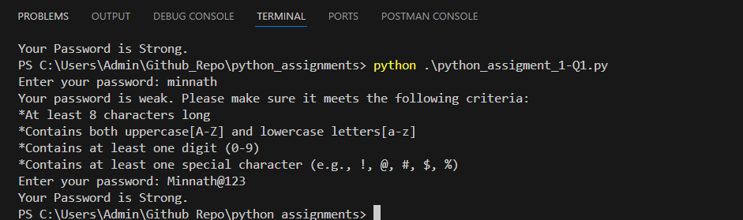
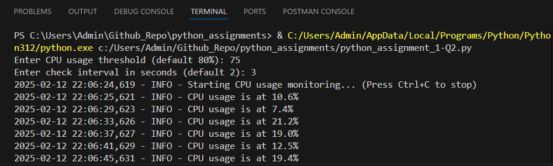
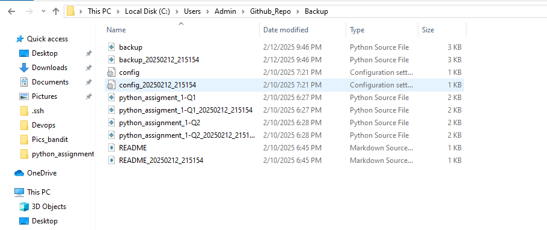

# Python Assignments Repository

## Overview
This repository contains Python scripts for various assignments, including password strength validation, CPU usage monitoring, and automated file backup. Each script serves a unique purpose and provides useful functionalities.

## Table of Contents
- [Files Included](#files-included)
- [Installation](#installation)
- [Usage](#usage)
  - [Password Strength Checker](#password-strength-checker)
  - [CPU Usage Monitor](#cpu-usage-monitor)
  - [Backup Script](#backup-script)
- [Screenshots](#screenshots)

## Files Included
- **python_assignment_1-Q1.py** - Script to validate password strength.
- **python_assignment_1-Q2.py** - Script to monitor CPU usage and log results.
- **backup.py** - Script to back up files from one directory to another.
- **Images** (for reference and output verification):
  - `password_strength.png`
  - `cpu_usage.png`
  - `backup.png`

## Installation
1. Clone this repository using:
   ```bash
   git clone https://github.com/YOUR_GITHUB_USERNAME/YOUR_REPOSITORY_NAME.git
   ```
2. Navigate to the project directory:
   ```bash
   cd YOUR_REPOSITORY_NAME
   ```
3. Ensure you have Python installed. Check with:
   ```bash
   python --version
   ```
4. Install required dependencies (if any):
   ```bash
   pip install -r requirements.txt
   ```

## Usage
### Password Strength Checker
This script verifies if a password meets the required security criteria (length, uppercase, digit, and special character).
Run the script using:
```bash
python python_assignment_1-Q1.py
```
Output:
```
Enter your password: minnath
Your password is weak. Please make sure it meets the following criteria:
* At least 8 characters long
* Contains both uppercase [A-Z] and lowercase letters [a-z]
* Contains at least one digit (0-9)
* Contains at least one special character (e.g., !, @, #, $, %)
Enter your password: Minnath@123
Your Password is Strong.
```

### CPU Usage Monitor
This script monitors CPU usage at specified intervals and logs the results.
Run the script using:
```bash
python python_assignment_1-Q2.py
```
Output:
```
Enter CPU usage threshold (default 80%): 75
Enter check interval in seconds (default 2): 3
INFO - CPU usage is at 10.6%
INFO - CPU usage is at 7.4%
INFO - CPU usage is at 21.2%
INFO - CPU usage is at 19.0%
```

### Backup Script
This script copies files from a source directory to a backup directory, appending timestamps to avoid duplicates.
Run the script using:
```bash
python backup.py
```
Output:
```
Copied: file1.txt -> Backup/file1_20250212_215154.txt
Copied: config.txt -> Backup/config_20250212_215154.txt
```

## Screenshots
### Password Strength Checker Output


### CPU Usage Monitor Output


### Backup Script Output


## Contributing
Feel free to fork this repository and submit pull requests with enhancements or bug fixes.

## License
This project is licensed under the MIT License.

